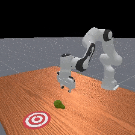
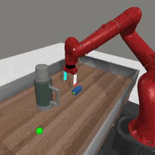
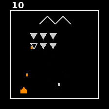

<h1>Embedding Temporal Logic (ETL) — Anonymous Submission</h1>

Anonymous Author(s)



----

## Repository Structure

```
.
├── tdmpc2/               # Newt world model — provides embeddings for MetaWorld experiments
├── etl_d3il/             # ETL evaluation on D3IL sorting & stacking tasks
├── etl_image_ablations/  # ETL evaluation on MetaWorld and DROID
├── csv/                  # Precomputed results
├── assets/               # Task visualizations
├── docker/               # Docker setup
└── download_checkpoints.py
```

----

## Getting started

### Option 1: Local installation with conda

```bash
conda env create -f docker/environment.yaml
conda activate newt
pip install --no-cache-dir 'ale_py==0.10'
export MS_SKIP_ASSET_DOWNLOAD_PROMPT=1
```

Download required ManiSkill assets (needed for MetaWorld experiments):

```bash
wget https://huggingface.co/datasets/nicklashansen/mmbench/resolve/main/maniskill.tar.gz
tar -xvf maniskill.tar.gz && mv .maniskill ~ && rm maniskill.tar.gz
```

### Option 2: Docker

```bash
cd docker && docker build . -t etl:1.0.0
```

----

## Experiments

### Dubins Car (Section 5.1)

The Dubins car experiments use the encoder from the AnySafe world model (Agrawal et al., 2025). The evaluation code is available in the companion AnySafe repository. ETL monitoring evaluation can be run after loading the encoder following the instructions in that repository.

----

### Sorting & Stacking — D3IL (Section 5.2)

ETL vs. PCA-kmeans (Liu et al., 2024) and logpZO (Xu et al., 2025) on D3IL sequential manipulation tasks.

```bash
cd etl_d3il

# Install dependencies
conda env create -f environment.yml
conda activate etl_d3il

# Download D3IL rollout data and place in:
#   etl_d3il/data/{task}/rollouts/
# Data available at: https://drive.google.com/drive/folders/1VuI3eQmFHT2QKCSYZGQ2pAuuhwNJkGCu

# Run ETL vs baselines on sorting (prints table)
python scripts/run_etl_comparison.py task=sorting \
    methods='["etl","etl_temporal","etl_seq","similarity","logpzo"]'

# Run on stacking
python scripts/run_etl_comparison.py task=stacking \
    methods='["etl","etl_temporal","etl_seq","similarity","logpzo"]'

# Fast evaluation (obs_embeddings only)
python scripts/run_etl_fast.py --tasks stacking sorting --n_phases 3
```

**Three ETL variants:**
- `etl` — single-phase `F(near_goal)`
- `etl_temporal` — K-phase sequential `F(near_0 ∧ F(near_1 ∧ ... ∧ F(near_K)))` *(paper contribution)*
- `etl_seq` — sequential robustness via min-k distance

----

### MetaWorld pick-place-wall (Section 5.2)

ETL vs. PCA-kmeans and logpZO using Newt world model embeddings.

```bash
# Download Newt checkpoint
pip install -U huggingface_hub
python download_checkpoints.py --filename "soup-L" --cache-dir="./checkpoints"

# Run ETL sequential predicate evaluation
cd /path/to/repo
MUJOCO_GL=egl python -m etl_image_ablations.eval_mw_sequential_spec \
    --num-demos 40 --out-dir etl_results/mw_sequential

# Run baselines (PCA-kmeans, logpZO) + ETL comparison
MUJOCO_GL=egl python -m etl_image_ablations.eval_mw_baselines \
    --num-demos 40 --out-dir etl_results/mw_baselines
```

----

### DROID real-world evaluation (Section 5.3)

ETL vs. Qwen2-VL on phasic DROID episodes.

```bash
# Run ETL on DROID
python -m etl_image_ablations.eval_droid_etl

# Run VLM baseline (requires Qwen2-VL)
python -m etl_image_ablations.eval_vlm_droid_phasic

# Phasic evaluation
python -m etl_image_ablations.eval_droid_phasic
```

----

### Newt world model (training / checkpoints)

```bash
cd tdmpc2

# Download checkpoints
python download_checkpoints.py --all --cache-dir="./checkpoints"

# Train from scratch (200-task multitask)
python train.py

# Single-task
python train.py model_size=B task=metaworld-pick-place-wall-v2
```

----

## Precomputed Results

```python
import pandas as pd
results = pd.read_csv("./csv/newt/newt_avg.csv")
```

----

## License

MIT License. See `LICENSE` for details.
