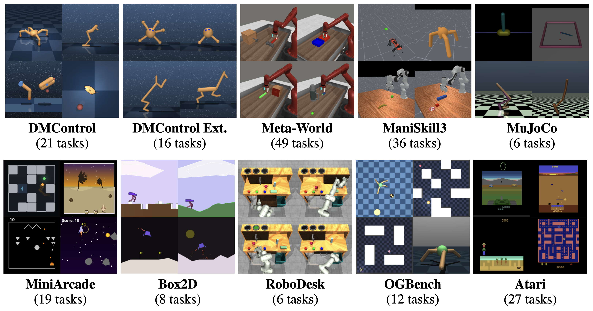
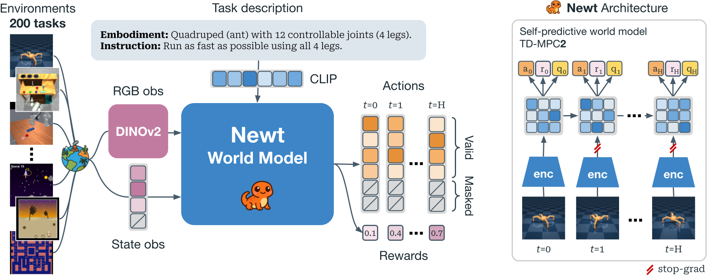

<h1>MMBench & Newt</h1>

Official code repository for the paper

**[Title redacted for anonymous review]**

Anonymous Authors

</br>

----

## MMBench

MMBench contains a total of **200** unique continuous control tasks for training of massively multitask RL policies. The task suite consists of 159 existing tasks proposed in previous work, 22 new tasks and task variants for these existing domains, as well as 19 entirely new arcade-style tasks that we dub *MiniArcade*. MMBench tasks span multiple domains and embodiments, and each task comes with language instructions, demonstrations, and optionally image observations, enabling research on both multitask pretraining, offline-to-online RL, and RL from scratch.

<br/>


## Newt

Newt is a language-conditioned multitask world model based on [TD-MPC2](https://www.tdmpc2.com). We train Newt by first pretraining on demonstrations to acquire task-aware representations and action priors, and then jointly optimizing with online interaction across all tasks. To extend TD-MPC2 to the massively multitask online setting, we propose a series of algorithmic improvements including a refined architecture, model-based pretraining on the available demonstrations, additional action supervision in RL policy updates, and a drastically accelerated training pipeline.

<br/>

----

## Repository Structure

```
.
├── tdmpc2/               # Core Newt/TD-MPC2 implementation
├── fiper_etl/            # ETL evaluation on sorting & stacking tasks
├── etl_image_ablations/  # MetaWorld ETL experiments and ablations
├── csv/                  # Precomputed results (newt, tdmpc2, baselines)
├── assets/               # Task visualizations
├── docker/               # Docker setup
└── download_checkpoints.py
```

----

## Getting started

We provide three options for getting started with our codebase: (1) local installation using `conda`, (2) building a `docker` image using our provided `Dockerfile`, or (3) using our prebuilt `docker` image hosted on Docker Hub.

First, we recommend downloading required ManiSkill assets from HuggingFace:

```bash
wget https://huggingface.co/datasets/nicklashansen/mmbench/resolve/main/maniskill.tar.gz
tar -xvf maniskill.tar.gz && mv .maniskill ~ && rm maniskill.tar.gz
```

This creates a `.maniskill` folder in your home directory (the default location for ManiSkill assets). You can specify a different location with `MANISKILL_ASSET_DIR`.

### Option 1: Local installation with conda

```bash
conda env create -f docker/environment.yaml
conda activate newt
pip install --no-cache-dir 'ale_py==0.10'
export MS_SKIP_ASSET_DOWNLOAD_PROMPT=1
```

### Option 2: Building a docker image

```bash
cd docker && docker build . -t newt:1.0.0
```

### Option 3: Using a prebuilt docker image

```bash
docker pull nicklashansen/newt:1.0.0
```

----

## Experiments

### MetaWorld (ETL image ablations)

Sequential predicate evaluation (e.g., grasp → place) on MetaWorld tasks using Newt embeddings:

```bash
# Run ETL evaluation on MetaWorld
cd /path/to/repo
MUJOCO_GL=egl python -m etl_image_ablations.eval_mw_sequential_spec \
    --num-demos 40 --out-dir etl_results/mw_sequential

# Run FIPER baselines on MetaWorld
MUJOCO_GL=egl python -m etl_image_ablations.eval_mw_fiper_baselines \
    --num-demos 40 --out-dir etl_results/mw_fiper_baselines

# Run full ETL ablation suite
python -m etl_image_ablations.run_image_etl_ablations
```

See `etl_image_ablations/` for additional scripts including conformal prediction thresholds, cross-task avoidance, and visualization tools.

### Sorting & Stacking (FIPER-ETL benchmark)

ETL evaluated against FIPER baselines on sequential manipulation tasks:

```bash
cd fiper_etl

# Install dependencies
conda env create -f environment.yml
conda activate fiper

# Download rollout data (see fiper_etl/README.md for data setup)
# Place rollouts in: fiper_etl/data/{task}/rollouts/

# Fast comparison: ETL variants vs baselines
python scripts/run_etl_fast.py --tasks stacking sorting --n_phases 3

# Full comparison with table output
python scripts/run_etl_comparison.py task=sorting \
    methods='["etl","etl_temporal","etl_seq","similarity","logpzo"]'

# Complete pipeline (trains RND models + evaluates all methods)
python scripts/run_fiper.py
```

See `fiper_etl/ETL_README.md` for a full description of the three ETL variants and comparison with baselines.

### Training Newt

```bash
cd tdmpc2

# Train a 20M parameter agent on all 200 MMBench tasks
python train.py

# Train with larger model (80M parameters)
python train.py model_size=XL

# Train a single-task agent
python train.py model_size=B task=walker-walk

# Train with RGB observations
python train.py obs=rgb

# Resume from checkpoint
python train.py checkpoint=<path/to/checkpoint.pt>
```

### Loading checkpoints

```bash
pip install -U huggingface_hub

# Download a single checkpoint
python download_checkpoints.py --filename "walker-walk" --cache-dir="./checkpoints"

# Download all checkpoints
python download_checkpoints.py --all --cache-dir="./checkpoints"
```

Multitask checkpoints use a `soup` prefix; model size is in the filename (`S=2M`, `B=5M`, `L=20M`, `XL=80M`). Use `model_size=B` when loading single-task checkpoints.

### Generating demonstrations

```bash
cd tdmpc2
python generate_demos.py task=walker-walk +num_demos=10 data_dir=<path/to/data>
```

----

## Precomputed Results

Precomputed results for Newt and baselines are in `csv/`. Results are provided at three levels of aggregation: `avg`, `by_domain`, and `by_task`.

```python
import pandas as pd
results = pd.read_csv("./csv/newt/newt_avg.csv")
```

----

## License

This project is licensed under the MIT License — see the `LICENSE` file for details. The repository relies on third-party code subject to their respective licenses.
